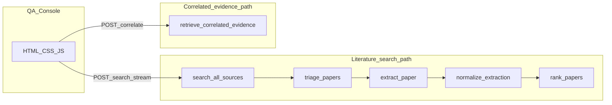
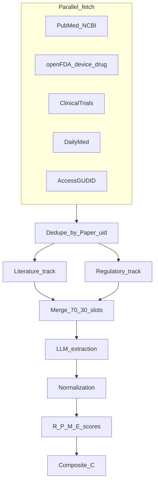
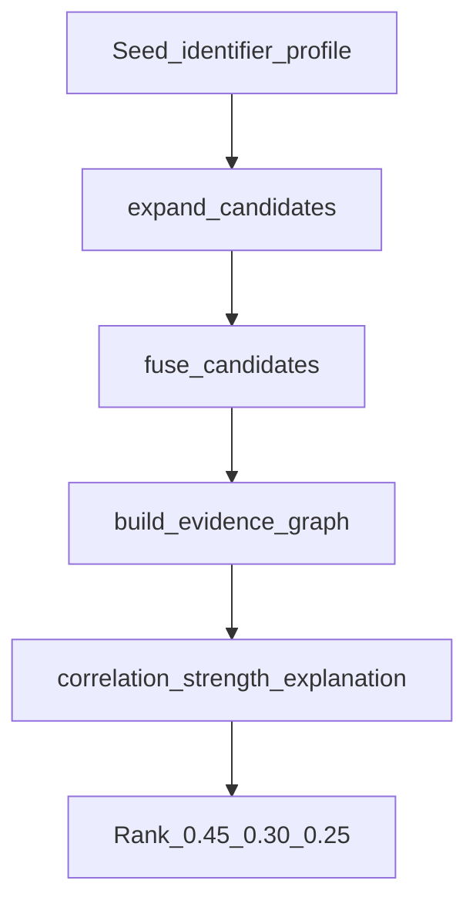

# MedLit Ranking Tool — Developer Notes

**Living document.** Update this file when architecture, APIs, or major behavior changes. Keep sections in sync with [`docs/product_spec.md`](docs/product_spec.md), [`docs/ranking_spec.md`](docs/ranking_spec.md), and [`docs/triage_pubmed_openfda.md`](docs/triage_pubmed_openfda.md).

---

## 1. Overview

### What this program does

The **MedLit Ranking Tool** is a FastAPI application that:

1. **Searches** multiple medical/regulatory data sources in parallel (PubMed, openFDA, ClinicalTrials.gov, DailyMed, AccessGUDID), building a unified pool of [`Paper`](app/models/paper.py) records.
2. **Triages** the pool with a hybrid **deterministic pre-score + LLM relevance score** to select the top `max_results` items for deeper processing.
3. **Extracts** structured evidence from each selected paper via an LLM ([`ExtractionResult`](app/models/extraction.py)).
4. **Normalizes** device/drug/material fields deterministically ([`NormalizedProduct`](app/models/normalized.py)).
5. **Ranks** papers using four dimensions — **R** (relevance), **P** (product similarity), **M** (metric favorability), **E** (evidence quality) — into a **composite** score and [`RankedPaperResponse`](app/models/ranking.py) rows.

A **second pipeline** (correlated-evidence retrieval) runs from [`POST /api/v1/retrieval/correlate`](app/api/retrieval.py): it expands from a **seed** identifier, fuses candidates, builds a graph, scores **correlation / strength / explanation**, and returns ranked external evidence — separate from the main R/P/M/E ranking (see section 7).

### Tech stack

| Layer | Technology |
|--------|------------|
| Web | FastAPI, Uvicorn (see [`scripts/dev_server.py`](scripts/dev_server.py)) |
| Language | Python 3.11+ (CI/dev may use newer 3.x) |
| LLM | OpenAI-compatible Chat Completions API; optional **NVIDIA NIM** backend ([`app/core/config.py`](app/core/config.py)) |
| Persistence | SQLite via SQLAlchemy **Core** — JSON blobs for papers, extractions, normalizations, evidence cache, correlation cache ([`app/services/db.py`](app/services/db.py)) |
| Frontend | Jinja2 template [`app/templates/index.html`](app/templates/index.html), vanilla JS [`app/static/app.js`](app/static/app.js), CSS [`app/static/style.css`](app/static/style.css) |

### Application modes (`APP_MODE`)

| Mode | Behavior |
|------|----------|
| `demo` | Search uses [`app/demo/fixtures.py`](app/demo/fixtures.py) triples (Paper + Extraction + Normalized); no live PubMed pool |
| `dev` / `prod` | Live multi-source pool, triage, extraction, DB cache — subject to API keys and network |

Mode can be toggled in-memory via [`POST /api/v1/admin/set-mode`](app/api/admin.py) (does not rewrite `.env`).

---

## 2. Architecture (high level)

### Search path (detail)

### Correlated-evidence path (detail)

---

## 3. Directory layout

Below: **one-line purpose** per area. Paths are under `medlit-ranking-tool/`.

### `app/`

| Path | Purpose |
|------|---------|
| [`app/main.py`](app/main.py) | FastAPI app, CORS, static mount, template router, includes all API routers, serves `/` QA console |
| [`app/core/config.py`](app/core/config.py) | `Settings`, `get_llm_client_config`, NIM extras |
| [`app/core/logging.py`](app/core/logging.py) | Logging setup |
| [`app/api/`](app/api/) | HTTP routers: `health`, `search`, `papers`, `admin`, `qa`, `retrieval`; shared [`models.py`](app/api/models.py) (`SearchResponse`, `PaperDetailResponse`) |
| [`app/models/`](app/models/) | Pydantic: `paper`, `search`, `extraction`, `normalized`, `ranking` |
| [`app/services/`](app/services/) | `pubmed`, `pool`, `triage`, `extraction`, `db` |
| [`app/clients/`](app/clients/) | Async HTTP clients: openFDA, ClinicalTrials, DailyMed, AccessGUDID, FDA PDF downloads |
| [`app/ranking/`](app/ranking/) | R, P, M, E sub-scores + `composite.rank_papers`, `relevance_agent` |
| [`app/normalization/`](app/normalization/) | Registry + anatomy, devices, drugs, materials normalizers |
| [`app/retrieval/`](app/retrieval/) | Correlated-evidence pipeline: `pipeline`, `expansion`, `fusion`, `graph`, `scoring`, `models`, `enums` |
| [`app/retrieval_bench/`](app/retrieval_bench/) | Benchmark harness + `targets.json` |
| [`app/demo/`](app/demo/) | Demo fixtures for `demo` mode |
| [`app/static/`](app/static/) | `app.js`, `style.css` |
| [`app/templates/`](app/templates/) | `index.html` |

### `tests/`

| Path | Purpose |
|------|---------|
| `tests/` root | `test_triage.py`, `test_relevance_agent.py`, placeholder |
| `tests/clients/` | Unit tests for external API clients |
| `tests/collection/` | Gold cases JSON, loaders, manifest tests |
| `tests/integration/` | API + app integration (search, health, papers, demo, retrieval UI; gated gold/live) |
| `tests/normalization/` | Normalization unit tests |
| `tests/ranking/` | Composite, R, P, M, E tests |
| `tests/retrieval/` | Pipeline, graph, fusion, expansion, correlation scoring |
| `tests/retrieval_bench/` | Slow benchmark tests (`@pytest.mark.slow`) |
| `tests/services/` | PubMed query builder, extraction coerce |

### `scripts/` (see also [section 12](#12-scripts))

Summarized here; full table in section 12.

### `docs/`

| File | Purpose |
|------|---------|
| [`docs/product_spec.md`](docs/product_spec.md) | Product-level spec |
| [`docs/ranking_spec.md`](docs/ranking_spec.md) | Ranking dimensions and rules |
| [`docs/triage_pubmed_openfda.md`](docs/triage_pubmed_openfda.md) | Triage behavior (PubMed vs regulatory records) |
| [`docs/extraction_schema.json`](docs/extraction_schema.json) | JSON Schema for extraction output |
| [`docs/overnight_scoring_summary.md`](docs/overnight_scoring_summary.md) | Scoring change notes |
| `docs/benchmark_*` | Benchmark narrative and tables for retrieval evaluation |

---

## 4. Data models (summary)

| Model | Location | Role |
|-------|----------|------|
| **`Paper`** | [`app/models/paper.py`](app/models/paper.py) | Ingested metadata: `pmid`, `doi`, `identifier`, `source`, title, abstract, MeSH, etc. **`uid`** = `pmid` or `identifier` or `hash(title)` — primary key for DB and caches |
| **`SearchRequest`** | [`app/models/search.py`](app/models/search.py) | Query, `target_product`, `target_metrics`, weights, `pool_size` (per DB), `max_results`, filters, `submission_type` presets |
| **`TargetProductProfile`** | same | Device and/or drug target fields for P scoring and PubMed query building |
| **`ExtractionResult`** | [`app/models/extraction.py`](app/models/extraction.py) | LLM output: synopsis, topical relevance, device/drug blocks, study, metrics, qualitative findings |
| **`NormalizedProduct`** | [`app/models/normalized.py`](app/models/normalized.py) | Canonical `NormalizedDevice` / `NormalizedDrug` + `product_type` |
| **`RankedPaperResponse`** | [`app/models/ranking.py`](app/models/ranking.py) | API row: composite, R/P/M/E, breakdowns, rationale, labels |
| **`EvidenceRecord`** | [`app/retrieval/models.py`](app/retrieval/models.py) | Correlated-evidence candidate (identifier, source_type, payload) |
| **`ExtractedTargetProfile`** | [`app/retrieval/models.py`](app/retrieval/models.py) | Seed-side profile for correlation scoring |
| **`CorrelationResult`** | same | Per-candidate correlation, strength, explanation, tier, etc. |
| **`RetrievalResponse`** | same | Full correlate endpoint response + metadata |

---

## 5. API endpoints

| Method | Path | Purpose |
|--------|------|---------|
| GET | `/` | QA Console HTML (not in OpenAPI schema) |
| GET | `/health` | Env, mode, LLM backend/model, PubMed live flag |
| POST | `/api/v1/search` | Non-streaming search → ranked results |
| POST | `/api/v1/search/stream` | SSE: pool batches, triage accepts, per-paper progress, results |
| GET | `/api/v1/papers/{pmid}` | Paper metadata (demo fixtures or DB) — path param name is legacy; may be non-PMID `uid` in live mode |
| POST | `/api/v1/papers/{pmid}/extract` | Run or return cached extraction |
| GET | `/api/v1/papers/{pmid}/detail` | Paper + extraction + normalized + mode |
| POST | `/api/v1/admin/set-mode` | Set `APP_MODE` in process |
| GET | `/api/v1/qa/gold-cases` | Load gold QA cases from `tests/collection/cases.json` |
| POST | `/api/v1/retrieval/correlate` | Correlated-evidence retrieval (`CorrelateRequest`: seed, query, profile) |
| GET | `/api/v1/retrieval/benchmark/{target_id}` | Load one benchmark target from `app/retrieval_bench/targets.json` |

Shared response wrappers: [`app/api/models.py`](app/api/models.py) (`SearchResponse`, `PaperDetailResponse`).

---

## 6. Search pipeline (detailed)

### 6.1 Pool — [`app/services/pool.py`](app/services/pool.py)

- **`search_all_sources(query, target_product, pool_size, ...)`** runs **asyncio.gather** on:
  - **PubMed** — [`build_pubmed_query`](app/services/pubmed.py) + [`search_pubmed`](app/services/pubmed.py) (up to `pool_size` hits)
  - **openFDA** — `search_device`, `search_drug_label` (each up to `limit=pool_size`)
  - **ClinicalTrials** — condition/intervention from profile or free-text query
  - **DailyMed** — SPL search by ingredient/name/query
  - **AccessGUDID** — device search by brand or free text
- Each raw record is converted to **`Paper`** via `_trial_to_paper`, `_510k_to_paper`, `_drug_label_to_paper`, `_dailymed_to_paper`, `_gudid_to_paper`.
- **Dedup:** first occurrence wins per **`Paper.uid`**.
- Returns **`PoolResult(papers, source_counts)`**.

### 6.2 Triage — [`app/services/triage.py`](app/services/triage.py)

- **Split tracks:** anything with `source in _REGULATORY_SOURCES` (`openFDA`, `ClinicalTrials`, `DailyMed`, `AccessGUDID`) uses the **regulatory** pre-score and **`_REGULATORY_TRIAGE_SYSTEM`** LLM prompt; **PubMed** (and any non-listed source) uses **literature** weights and **`_TRIAGE_SYSTEM`**.
- **Slot allocation:** `_allocate_slots` — when both tracks non-empty, roughly **70% literature / 30% regulatory** (`_REGULATORY_SLOT_FRACTION = 0.30`), capped so both tracks get at least one slot when possible. Underflow in one track triggers an extra triage pass on the other to backfill.
- **Literature pre-score:** `query_title`, `query_abstract`, `profile_signal`, `mesh_overlap` — weights `_PRE_WEIGHTS`.
- **Regulatory pre-score:** `query_title`, `profile_signal`, `identifier_match` — `_REGULATORY_PRE_WEIGHTS` (no penalty for missing abstract/MeSH).
- **Combined score:** `0.35 * pre + 0.65 * llm` when LLM scores exist; anchors get a floor (`_ANCHOR_FLOOR`) on the literature track.
- **Anchors:** [`detect_anchors`](app/services/triage.py) — target drug/device name substring in **title** (literature track only). Anchor selection in `_combine_and_select` is **capped at `top_n`** so anchors cannot consume all slots.
- **LLM output:** lines `UID<TAB>SCORE`; parse with `_parse_scored_lines` — instruct model to use the value after **`ID=`** on each prompt line.

See also [`docs/triage_pubmed_openfda.md`](docs/triage_pubmed_openfda.md).

### 6.3 Extraction — [`app/services/extraction.py`](app/services/extraction.py)

- Builds user prompt from title, abstract, PMID/DOI, optional **metrics of interest** hints.
- LLM returns JSON → **`_coerce_llm_output`** (sanitize device/drug, fix metrics, strip unknown `regulatory` key) → **`ExtractionResult`**.
- On failure: **`_fallback_extraction`** with low topical relevance and warnings.

### 6.4 Normalization — [`app/normalization/__init__.py`](app/normalization/__init__.py)

- **`normalize_extraction(extracted)`** → **`NormalizedProduct`**: dictionary/rule mapping for anatomy, device categories, drugs, materials (see [`registry.py`](app/normalization/registry.py)).

### 6.5 Ranking — [`app/ranking/composite.py`](app/ranking/composite.py)

- **R:** [`merge_relevance_llm`](app/ranking/relevance_agent.py) — blend of LLM relevance JSON and deterministic [`score_relevance`](app/ranking/relevance.py) + recency (`_LLM_BLEND` / `_RECENCY_BLEND`).
- **P:** [`score_product_similarity`](app/ranking/product_similarity.py) if `target_product` present; uses submission-type sub-weights from [`SUBMISSION_PRESETS`](app/models/search.py) when set.
- **M:** [`score_metric_favorability`](app/ranking/metric_favorability.py) from `target_metrics` or coverage fallback from `metrics_of_interest`.
- **E:** [`score_evidence_quality`](app/ranking/evidence_quality.py) from study design, sample size, follow-up, comparator, domain cap.
- **Composite:** weighted sum of active dimensions; renormalize weights if a dimension is excluded. Optional **`similarity_threshold`** filters low composites.

---

## 7. Correlated-evidence retrieval

Implemented in [`app/retrieval/pipeline.py`](app/retrieval/pipeline.py) and related modules.

**Stages (conceptual):**

1. Resolve **seed** record and profile (`ExtractedTargetProfile`; optional overrides from API).
2. **expand_candidates** — parallel PubMed, openFDA (device + label), ClinicalTrials, DailyMed, AccessGUDID ([`expansion.py`](app/retrieval/expansion.py)).
3. **fuse_candidates** — merge duplicates by canonical identifier ([`fusion.py`](app/retrieval/fusion.py)).
4. **build_evidence_graph** — nodes/edges, relation inference, **tier** labels ([`graph.py`](app/retrieval/graph.py)).
5. **correlation_score** — weighted feature vector (e.g. same product identity, regulatory overlap, endpoints); see `FEATURE_WEIGHTS` in [`scoring.py`](app/retrieval/scoring.py).
6. **evidence_strength_score**, **explanation_value_score** — same module.
7. **Rank** candidates: **`0.45 * correlation + 0.30 * strength + 0.25 * explanation`** (constants in `pipeline.py`). Tier-1 benchmark validation can emit warnings.

This pipeline **does not** call `app/ranking/composite.py`; it is a separate scoring model for “evidence related to our submission.”

---

## 8. External API clients

| Client | File | Notes |
|--------|------|--------|
| PubMed | [`app/services/pubmed.py`](app/services/pubmed.py) | NCBI E-utilities: `esearch`, `efetch`, XML → `Paper` |
| openFDA | [`app/clients/openfda.py`](app/clients/openfda.py) | 510(k), PMA, drug label, drug event JSON; optional API key |
| ClinicalTrials | [`app/clients/clinicaltrials.py`](app/clients/clinicaltrials.py) | v2 `/studies` |
| DailyMed | [`app/clients/dailymed.py`](app/clients/dailymed.py) | SPL JSON |
| AccessGUDID | [`app/clients/accessgudid.py`](app/clients/accessgudid.py) | Device lookup/search |
| FDA PDFs | [`app/clients/fda_downloads.py`](app/clients/fda_downloads.py) | Direct PDF fetch from accessdata.fda.gov (bytes) |

All use `httpx` async; retries on openFDA/CT clients per implementation.

---

## 9. Configuration

[`app/core/config.py`](app/core/config.py) — **`Settings`** (pydantic-settings):

- **LLM:** `LLM_API_KEY`, `LLM_MODEL`, `LLM_BASE_URL`, `LLM_BACKEND` (`default` | `nvidia_nim`), NIM-specific vars, **`get_llm_extra_request_kwargs`** for NIM “thinking” disable.
- **NCBI:** `NCBI_API_KEY`, `NCBI_EMAIL`
- **External APIs:** `OPENFDA_*`, `CLINICALTRIALS_BASE_URL`, `DAILYMED_BASE_URL`, `ACCESSGUDID_BASE_URL`
- **DB:** `DATABASE_URL` (SQLite default path)
- **App:** `APP_ENV`, **`APP_MODE`**, `LOG_LEVEL`

`.env` is loaded from repo root; **dotenv overrides environment** for same keys (see `settings_customise_sources`) to avoid stale shell `APP_MODE`.

---

## 10. Frontend (QA Console)

- **Single-page** console at `/`: search form (presets, target profile, metrics, weights, filters), **SSE** search via `POST /api/v1/search/stream`, results table with sortable columns, expandable row detail (fetches `/api/v1/papers/{id}/detail`).
- **Correlated evidence:** seed + optional profile fields; `POST /api/v1/retrieval/correlate`; separate table with feature breakdown expansion.
- **i18n:** English / Chinese toggle via `_T` map in [`app/static/app.js`](app/static/app.js).
- **Gold cases:** populated from `/api/v1/qa/gold-cases`.
- **No** React/Vue — plain JS, ~1400+ lines of CSS in [`app/static/style.css`](app/static/style.css).

---

## 11. Testing

- Run: `pytest` from `medlit-ranking-tool/` (see [`pyproject.toml`](pyproject.toml)).
- **Slow:** `tests/retrieval_bench/` marked `@pytest.mark.slow`.
- **Gated integration:** e.g. `RUN_GOLD_PIPELINE=1`, `RUN_LIVE_COLLECTION=1` for live API tests (see integration test files).
- **Client tests** may require network or be mocked — check each `conftest.py`.

---

## 12. Scripts

| Script | Purpose |
|--------|---------|
| [`scripts/dev_server.py`](scripts/dev_server.py) | Run Uvicorn on a free port (env `MEDLIT_PORT` or defaults such as 8000, 8001, 8010, 8765) |
| [`scripts/smoke_nim_llm.py`](scripts/smoke_nim_llm.py) | Smoke-test NVIDIA NIM LLM connectivity (`LLM_BACKEND=nvidia_nim`) |
| [`scripts/verify_collection_pubmed.py`](scripts/verify_collection_pubmed.py) | Verify golden PMIDs from gold cases appear in PubMed search pools |
| [`scripts/check_pmid_rank.py`](scripts/check_pmid_rank.py) | Ad-hoc: rank of a fixed PMID under several query variants |

---

## 13. Known design decisions and trade-offs

| Decision | Rationale |
|----------|-----------|
| **Split triage tracks** | Regulatory records lack abstracts/MeSH; uniform PubMed-style pre-score would systematically demote openFDA/CT/DailyMed/GUDID. |
| **JSON in SQLite** | Fast to ship; no ORM migrations. Trade-off: ad-hoc schema evolution in JSON. |
| **Ophthalmology-biased extraction prompt** | Strong defaults for current domain; generalize by editing prompts and normalizer dictionaries. |
| **Title-only anchors** | Cheap deterministic guarantee; deeper match delegated to LLM. |
| **Two scoring systems** | Main search uses R/P/M/E for “best papers for our query/profile.” Retrieval uses correlation/strength/explanation for “evidence graph around a seed.” Do not mix formulas without an explicit product decision. |
| **`Paper.uid` for keys** | Unifies PubMed and non-PubMed rows; ensure API callers treat `pmid` path params as opaque identifiers where documented. |

---

## 14. Changelog (developer-maintained)

| Date | Change |
|------|--------|
| 2026-04-13 | Added this `DEVELOPER_NOTES.md` as the living developer reference. |
| *(add entries above)* | *(major features, API changes, scoring/triage changes)* |

---

## 15. Quick reference — file → responsibility

| Concern | Primary file(s) |
|---------|-------------------|
| HTTP routes | `app/api/*.py`, `app/main.py` |
| Multi-source fetch | `app/services/pool.py` |
| Triage | `app/services/triage.py` |
| PubMed only | `app/services/pubmed.py` |
| LLM extraction | `app/services/extraction.py` |
| DB | `app/services/db.py` |
| R/P/M/E + composite | `app/ranking/composite.py`, `relevance.py`, `product_similarity.py`, `metric_favorability.py`, `evidence_quality.py` |
| Correlate API | `app/api/retrieval.py`, `app/retrieval/pipeline.py` |
| UI | `app/templates/index.html`, `app/static/app.js` |

---

*End of DEVELOPER_NOTES.md*
